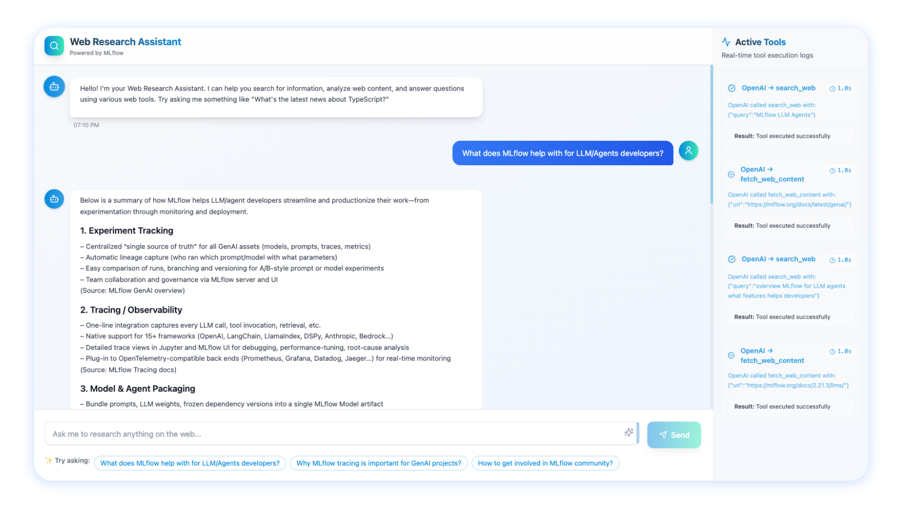
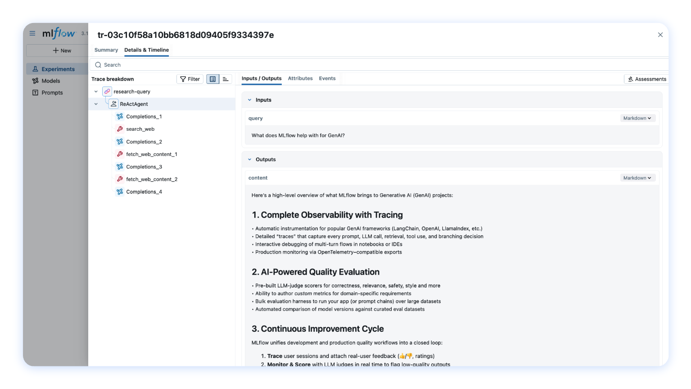

# MLflow TypeScript Tracing Demo Apps

This repository contains demo applications showcasing how to use [MLflow TypeScript SDK](https://npmjs.com/package/mlflow-tracing) to trace your full-stack TypeScript applications.



<p align="center">
  <em>The demo chatbot app</em>
</p>



<p align="center">
  <em>Traces in MLflow UI</em>
</p>

## Resources

- [📦 MLflow TypeScript SDK (npm)](https://npmjs.com/package/mlflow-tracing)
- [💻 MLflow Github Repository](https://github.com/mlflow/mlflow)
- [📖 MLflow TypeScript SDK Documentation](https://mlflow.org/docs/latest/genai/tracing/app-instrumentation/typescript-sdk)

## Quick Start

### Prerequisites

- Node.js >= 18
- npm or yarn
- Python >= 3.10 (Only required to run MLflow server. If you use [managed MLflow]())

### Installation

1. Clone the repository and install dependencies:
   ```bash
   npm run install:all
   ```

2. Start an application:

   Start the full-stack chatbot integrated with MLflow tracing using [MLflow Typescript SDK](https://npmjs.com/package/mlflow-tracing)

   ```bash
   npm run chatbot
   ```

   If you run the command for the first time, it will prompt you to setup the environment and MLflow tracking server.

   Once the app is running, you can access to the chatbot app at `http://localhost:5173` and ask questions.

3. Review the traces in MLflow UI

   Traces will be logged to the MLflow Experiment you specified in the setup process. Select the `Traces` tab to see the list of traces and click on each row to see the details, such as spans, timelines, messages, tool call parameters, etc.


## Application Details

### Basic App (`basic/`)

A simple Express server demonstrating:
- MLflow tracing integration
- OpenAI chat completions with automatic tracing
- Session and user context tracking

**Endpoints:**
- `POST /chat` - Send chat messages
- `GET /` - Health check

**Port:** 8000 (configurable via `PORT` env var)

### Chatbot App (`chatbot/`)

A full-stack React application with web research capabilities:

**Frontend** (`chatbot/frontend/`):
- React + TypeScript + Vite
- Real-time Socket.IO communication
- Markdown rendering for AI responses
- Tailwind CSS styling

**Server** (`chatbot/server/`):
- Express + Socket.IO server
- OpenAI agent with ReAct pattern
- Web search and content fetching tools
- MLflow tracing for all operations

**Ports:**
- Frontend: 5173 (Vite dev server)
- Server: 3001 (configurable via `PORT` env var)
